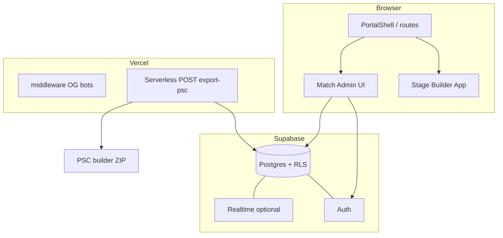

# Архітектура модуля матчів і прогалини (техніка, право, продукт)

**Статус:** чернетка (квітень 2026). **Зв’язок:** [MATCH_REGISTRATION_AND_PSC_PLAN.md](./MATCH_REGISTRATION_AND_PSC_PLAN.md), [PORTAL_PLAN.md](./PORTAL_PLAN.md), [TECH.md](./TECH.md).

---

## 1. Цільовий технічний малюнок

Один **SPA** (Vite + React), **один деплой** (Vercel). Новий функціонал не змішує глобальний стан Stage Builder з даними матчів.

| Шар | Відповідальність |
|-----|-------------------|
| **`features/stage-builder`** (існує) | Редактор `*.stage.json`, PDF; без залежності від таблиць матчів |
| **`features/match-admin`** (новий) | Сторінки матчу, заявки, скводи, підтвердження організатором |
| **`contracts/` або `types/matchExport.ts`** | DTO матчу порталу → вхід адаптера PSC; версія схеми |
| **`server/psc/` / `api/match-export-*`** | Збірка `match_def.json` + `match_scores.json`, ZIP → `.psc` (ключі лише на сервері) |
| **Supabase** | Таблиці матчів, RLS: `organizer_id`, роль `competitor`; існуюча **`shared_stages`** без зламів |

**Межі:** модуль матчів **не імпортує** з `stageStore`; для прив’язки вправи — або `share_id` і RPC/metadata, або snapshot JSON у storage — через контракт, описаний у плані реєстрації.

---

## 2. Узгодження з існуючими маршрутами та локаллю

| Тема | Рішення |
|------|---------|
| URL | Нові шляхи під `/:locale/...`, напр. `/:locale/matches`, `/:locale/matches/:id` — узгоджено з канонічним роутингом ([TECH.md](./TECH.md)) |
| Існуючі **`/stage-builder`**, **`/v/*`**, **`/e/*`** | Не змінювати; матч лише може містити посилання на share вправу |
| i18n | UK/EN для форм і статусів заявки з першого релізу модуля |

---

## 3. Дані й безпека (мінімум)

- **Auth:** Supabase Email (або OAuth пізніше); профіль із роллю «організатор» (флаг у `profiles` або membership у `match_organizers`).
- **RLS:** стрілець читає свої заявки + публічні поля матчу; організатор — повний CRUD по своїх матчах; анонім — лише публічна картка (без email інших учасників — за політикою).
- **PSC export:** лише **авторизований організатор** цього матчу; генерація на **сервері** (Edge Function або `api/*`), щоб не розкривати логіку обходу обмежень.

---

## 4. Що в коді / інфрі ще немає (технічні прогалини)

| Пункт | Стан |
|-------|------|
| Таблиці `matches`, `squads`, `registrations` + міграції | Немає — перший кодовий епік |
| RLS політики під ролі | Немає |
| UI маршрути `match-admin` + форми | Немає |
| Генератор `.psc` у production (TypeScript/Python на сервері), не лише Python-скрипт для розробника | Частково: є експеримент `scripts/practiscore/` |
| Єдиний **контракт** «матч порталу → JSON PS» у `src/` | Немає (лише текст у плані) |
| Тести сумісності PSC з версією PS | Лише ручний імпорт на пристрої |
| Окремий **staging**/`schema_version` для мігрованих матчів | Закласти в першій міграції |

---

## 5. Ліцензії й право на код (opensource)

| Пункт | Стан / рекомендація |
|-------|---------------------|
| **Ліцензія репозиторію** | Репозиторій **`private`**; файлу **`LICENSE`** у корені може не бути. Якщо планується **open source** — обрати ліцензію (MIT/Apache-2.0 тощо) і додати `LICENSE` + `package.json` поле **`license`**; перевірити **сумісність** політик вкладень (React, Three.js — ок). |
| **Залежності npm** | Регулярно **`npm audit`**; для релізу — список ліцензій залежностей (`npx license-checker-rseidelsohn --summary` або аналог) якщо потрібен аудит партнерами. |
| **Торгові знаки та чужі бренди в UI** | Не видавати «офіційне партнерство» з **IPSC**, **PractiScore** без листа/KД; у текстах — нейтрально «експорт у формат, сумісний з PractiScore 2» (як у [PORTAL_PLAN.md](./PORTAL_PLAN.md)). |

*Юридична оцінка:* не є юридичною порадою; для комерційного запуску — консультація з юристом.

---

## 6. Реєстрація бізнесу й персональні дані (оператор)

Тут «реєстрація» — не тільки **подача заявки стрільця**, а й **хто збирає дані** (власник сайту).

| Пункт | Що обміркувати |
|-------|----------------|
| **Суб'єкт господарювання (Україна)** | Якщо сервіс **платний** або систематичний з оборотом — часто доречні **ФОП або ТОВ**, податковий облік, можливість виставляти документи. Якщо **некомерційний/хобі** — режим простіший; при зміні моделі переглянути. |
| **Персональні дані (заявки, email)** | Оновити або додати **Політику конфіденційності** та **Умови використання**: мета зберігання, терміни, права доступу (GDPR-подібно для ЄС-користувачів), база роботи з Supabase (регіон тощо). |
| **Реквізити оплати «поза сайтом»** | Організатор матчу залишає IBAN/зручний спосіб у тексті матчу — **відповідальність організатора** за угоду з учасником; портал лише надає поле «примітка про оплату» (див. [MATCH_REGISTRATION_AND_PSC_PLAN.md](./MATCH_REGISTRATION_AND_PSC_PLAN.md)). |

---

## 7. Продукти й позиціонування (лінійка)

| Продукт / модуль | Зараз | Логічний напрям |
|------------------|-------|-----------------|
| **Stage Builder** | Free, core | Залишити базовий цикл без касту (як у [PORTAL_PLAN.md](./PORTAL_PLAN.md)) |
| **RO Helper, Hit Factor** | Free довідники | Без змін у цій архітектурі |
| **Match Admin (реєстрація + PSC)** | Немає | MVP: один інструмент для MD без paywall або з м’яким лімітом (рішення продукту пізніше) |
| **PRO / freemium** | У дорожній карті | Можливі: хмарна історія вправ (окремий епік), квоти — **не блокувати** завантаження `.psc` для базового сценарію організатора, якщо хочете adoption |

**Рішення pending:** чи входить «матчі» у free forever для організаторів локальних клубів і коли увімкнути монетизацію — зафіксувати окремо від першого технічного релізу.

---

## 8. Орієнтир UX: центр реєстрації й заведення матчів (UA)

**Зовнішній референс (український ринок):** ресурс **[practicarms.ua](https://practicarms.ua/)** — календар стрілецьких подій з обліковим записом, фільтрами (тип події змагання/тренування, дисципліна «практична стрільба», місто, тип зброї), картками події (час, локація, координати, організатор), відображенням зайнятості **«X / Y»** місць або слотів, станами заявки («заявка розглядається», «місця закінчились», «реєстрація зупинена») та службовими розділами навколо організаторів і об’єктів.

**Як ми це використовуємо:** не як офіційне партнерство чи API-інтеграція без угоди, а як **еталон патернів UX** під майбутній **центр реєстрації та управління матчами** на Shooters Tools: підхід користувача до каталогу й фільтрів, картки події, лічильник місць, зрозумілі порожні та завершені стани реєстрації, авторизація для подачі заявки.

**Диференціація нашого продукту:** PracticArms не закриває ланцюг **проєктування вправ** у Stage Builder → **PDF-брифінги** → експорт **`.psc`** для PractiScore 2; це наш основний акцент для організатора поруч із календарем і заявками.

Зв’язок з фазами реалізації — [MATCH_REGISTRATION_AND_PSC_PLAN.md](./MATCH_REGISTRATION_AND_PSC_PLAN.md).

---

## 9. Підсумок: пріоритет «закрити прогалини»

1. **Техніка:** міграції Supabase → RLS → мінімальний UI → серверний PSC.  
2. **Право/операційка:** при публічному запуску модуля з ПД — оновити privacy/terms; при комерції — облік ФОП/ТОВ (юрист + бухгалтер).  
3. **Продукт:** одна сторінка рішень: free vs PRO для модуля матчів.  
4. **Репозиторій:** за open source або ліцензія для партнерів — додати **`LICENSE`**.

---

*Оновлення цього документа — при першому merged модулі матчів, при зміні моделі монетизації або при оновленні UX-орієнтирів.*
